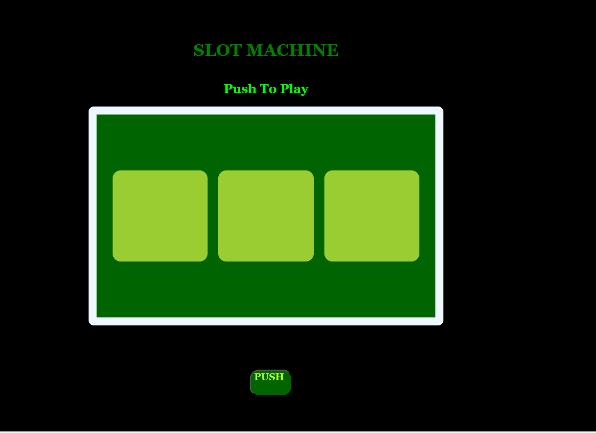

# Slot Machine

**Introduction:**
This project is a basic slot machine simulator written in JavaScript. It allows users to spin the reels and see if they win.
>**Usage:**
To use the slot machine simulator, open the “index.html” file in a web browser. Click the “Spin” button to initiate a spin. The results of the spin will be displayed on the reels, and a message indicating whether the player has won or should spin again will be shown.

>**How it Works:**
>*The slot machine simulator uses three reels, each displaying a random image from predefined set of images. 
>*If all three reels show the same image, the player wins.

>**Upcoming Features.**
updating UX and animations

